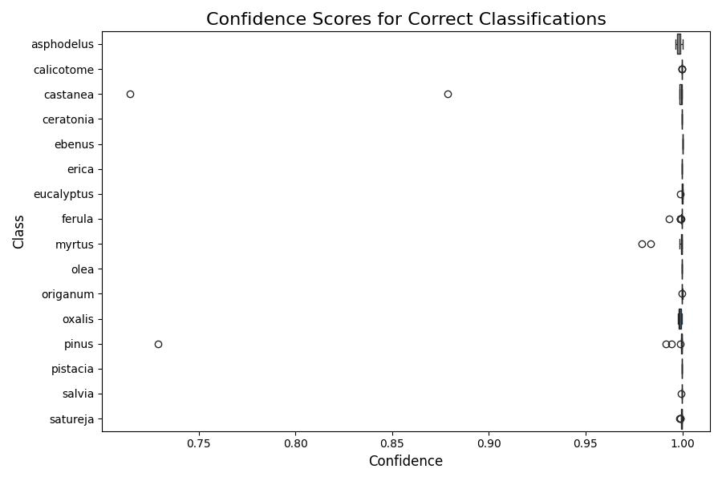
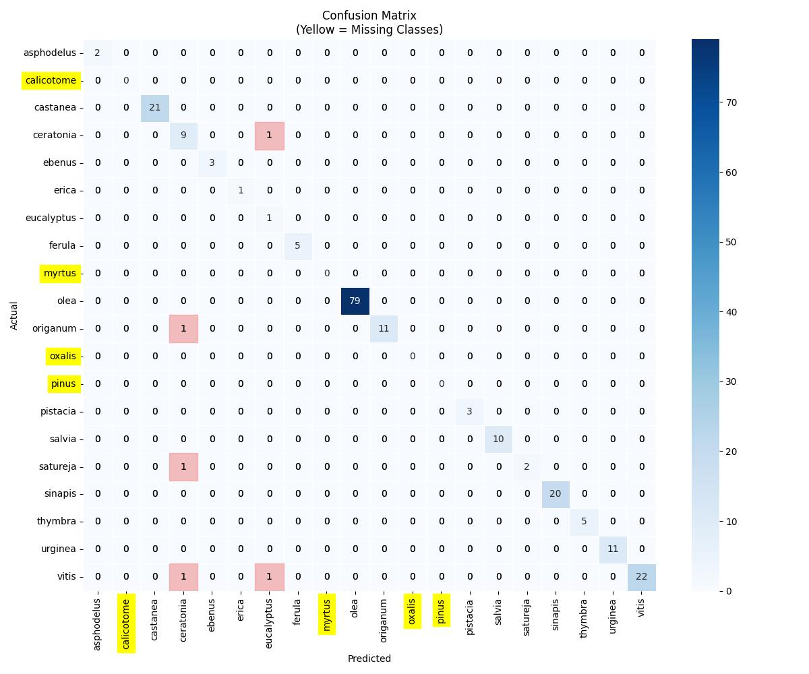
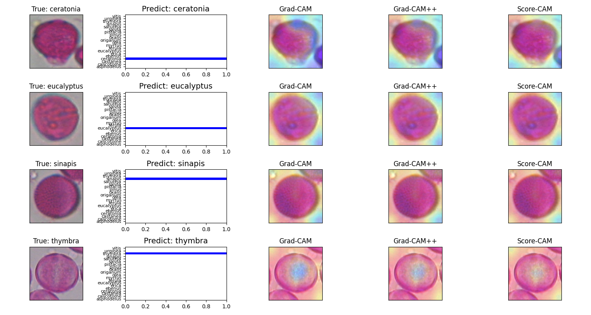
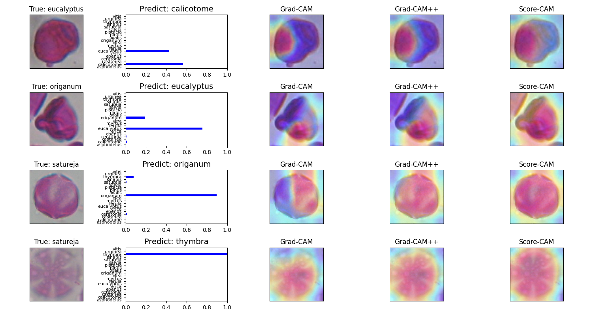

# Pollen_classification_CBAM

This project focuses on the classification of pollen grains, taking into account their characteristic views (Equatorial and Polar). The system is structured in three distinct phases:

**Phase 1:** Refinement of selected models and classification of datasets.

**Phase 2:** Separation of the test set into views (Equatorial and Polar) using pseudo-labeling.

**Phase 3:** Classification of the test set and evaluation of classification metrics.

To quickly run all tests, follow this menu:

**To run all the tests quickly, follow this menu:**

## Table of Contents

- [Pollen_classification_CBAM](#pollen_classification_view)
  - [Installation](#installation)
- [Usage](#usage)
  - [Phase 1](#phase-1)
  - [Phase 2](#phase-2)
  - [Phase 3](#phase-3)
- [Results](#Results)
  - [Results of Phase 3](#Results-of-dataset-separation-by-views)
- [Discussion](#Discussion)
  - [Consolidated results](#Consolidated-results)
  - [Test the Wilcoxon](#Test-wilcoxon)
  - [Compare metrics](#compare-metrics)
  - [Interpretability](#Interpretability)
- [Project Folder Structure](#project-Folder-Structure)
  - [Description of Key Folders](#description-of-Key-Folders)
  - [Resources](#resources)

# Installation

Follow the steps below to set up the project environment and dependencies.


**1. Create and activate the virtual environment**
There are several ways to create a virtual environment. In this project, the conda package was used, but you can also choose other tools such as venv or virtualenv based on your preference.

To create the virtual environment using conda, run the following command:
```bash
conda create --name tfGpu python=3.10.13
```

**Activate the virtual environment**:
```bash
conda activate tfGpu
```

**2. Clone the repository**
```bash
git clone https://github.com/jczars/Pollen-Classification-CBAM.git
```
**3. Install dependencies**
```bash
cd Pollen-Classification-CBAM/
pip install -r requirements.txt
```

**4. Verify the Installation**
After installing the dependencies, you can check if everything was set up correctly. Use the following commands to check the installed packages and the Python version:
```bash
pip list
python3 --version

```
5. Deactivate the Virtual Environment
Once you’re done working on the project, deactivate the virtual environment with the command:
```bash
conda deactivate
```
This will return you to the global system environment.

**6. Re-activate the Virtual Environment**
Whenever you continue working on the project, remember to reactivate the virtual environment:
```bash
conda activate tfGpu
```
By following these steps, you’ll have an isolated environment for the project using conda to manage dependencies and avoid conflicts with other Python installations on your system.

**7. Navigate to the project directory**
```bash
cd Pollen-Classification-CBAM
```

**8. Adjust the Python Path (if needed)**
If you encounter issues with module imports, you can manually adjust the `PYTHONPATH`:

Find the current directory:
Run the following command in the terminal to get the current working directory:

To include the project path:
```bash
pwd
```
Build the export PYTHONPATH command:
Combine the result of pwd with the rest of the command to set PYTHONPATH. Assuming the current directory is the desired one:
```bash
export PYTHONPATH=$(pwd):$PYTHONPATH
```

To remove the project path:
```bash
unset PYTHONPATH
```


[Table of contentes](#table-of-contents)

# Usage

## Phase 1
### Preprocess

**1. dowload dataset**:
**Cretan Pollen Dataset v1 (CPD-1):**

This is the selected dataset. Download the dataset to the BD folder. If the BD folder does not exist, create it in the root directory of the project.
Download the database available at: https://zenodo.org/records/4756361. Choose the Cropped Pollen Grains version and place it in the BD folder.
```bash
wget -O Cropped_Pollen_Grains.rar "https://zenodo.org/records/4756361/files/Cropped%20Pollen%20Grains.rar?download=1"

```
or
```bash
curl -L -o Cropped_Pollen_Grains.rar "https://zenodo.org/records/4756361/files/Cropped%20Pollen%20Grains.rar?download=1"
```
To extract the .rar file, you need to install the unrar tool (if not already installed):
```bash
sudo apt install unrar   # Ubuntu/Debian

```
This installs the unrar tool, which is necessary for extracting .rar files.
```bash
unrar x Cropped_Pollen_Grains.rar
```

**2. Renaming Dataset Classes:**

The database class names follow the syntax “1.Thymbra” (e.g., "1.Thymbra", "2.Erica"). We will rename the folders to follow a simpler format like “thymbra”.
Use the rename_folders.py script to rename the classes:

```bash
python3 preprocess/rename_folders.py --path_data BD/Cropped\ Pollen\ Grains/
```
This command runs the rename_folders.py script to rename the class folders inside the Cropped Pollen Grains directory. Each folder name will be converted to lowercase for consistency.

**3. Resize images dataset:**

This script reads the images from the Cropped Pollen Grains dataset and checks if they are in the standard size of 224 x 224. If any images do not meet these dimensions, the script creates a new dataset with all images resized to the specified size.

The resizing process uses a configuration file (config_resize.yaml) to define input and output paths, along with other parameters.

**Expected Result**:

A new dataset folder containing all images resized to 224 x 224, ensuring consistency across the dataset.

Usage: To run the resizing script with the configuration file, use the following command:

```bash
python3 preprocess/resize_img_bd.py --config preprocess/config_resize.yaml
```

**4. Prepare the Dataset for Cross-Validation and Data Augmentation**:

This script divides the dataset into separate folders to perform cross-validation and then applies data augmentation using a balancing strategy, where the goal variable specifies the target number of images per class. The script counts the samples in each class, and any class below the defined target is augmented until the target size is reached.

**Inputs**:
A YAML configuration file (example: config_balanced.yaml) that defines the parameters for the script execution.

**Expected Outputs**:
At the end of the execution, the script generates a balanced dataset with additional images for classes that initially have fewer samples. The balanced dataset is saved in the specified output folder.

**Example of Execution**:
To run the script, make sure the configuration file (config_balanced.yaml) is set up correctly and execute the following command:

```bash
python preprocess/split_aug_bd_k.py --config preprocess/config_aug_bd.yaml
```

### Fine-tuning
In this steps, pre-trained models are refined to classify the datasets generated in preprocess. The selected models include DenseNet201 and Xception. The fine-tuning process follows the DFT (Deeply Fine-Tuning) strategy to optimize the network performance.

**Required Configuration**:

To execute the tests, a spreadsheet containing the experimental configurations is required. The default configuration file can be found in the folder:

```bash
results/AT_densenet+cbam_exp/config_AT_cr_180225.xlsx
```
**Execution**:

Use the following command to run the fine-tuning script:
```bash
python phase1/AT_DenseNet_CBAM_K10_xlsx.py results/phase1/AT_densenet+cbam_exp/config_AT_cr_180225.xlsx
```
**Failure Management**:

During the tests, especially when using memory-intensive networks like DenseNet201, failures may occur due to full memory consumption. To address this, a spreadsheet with control variables tracks the progress of the tests, allowing for recovery.

**Control Variables**:

last_test_index: Index of the last completed test.
k_fold_number: Number of the current k-fold to be executed.
num_k_folds: Number of remaining k-folds to complete the cycle.
num_tests: Number of tests remaining to be executed.
Default Configuration
```bash
last_test_index = 0
k_fold_number = 1
num_k_folds = 10
num_tests = 3
```
This configuration runs 3 tests, covering all k-folds (k=1 to k=10) for each test.

**Recovery Example**:

If a test fails at index 6 with k=9, use the following configuration to resume:
```bash
last_test_index = 6
k_fold_number = 10
num_k_folds = 1
num_tests = 1
```
This setup ensures the tests are resumed in a controlled and efficient manner.

**Expected Results**:

The results are stored in the "results" folder where the spreadsheet is located. Two folders are created for each trained model:
one folder to save the trained models and another folder to save the reports.
The folder naming convention follows the pattern: id_test, model_name, and reports.
* results/AT_densenet+cbam_exp/0_DenseNet201
* results/AT_densenet+cbam_exp/0_DenseNet201_reports

The reports saved in reports include:
* **CSV** files containing metrics and detailed predictions.
* Classification report
* List of correct classifications
* List of incorrect classifications
* Confusion matrix

**Graphs** in JPG format, such as:
* Confusion matrix
* Training performance graph
* Boxplot of probabilities

This structure ensures organized storage and easy access to the results of each test.

[Table of contentes](#table-of-contents)

## Phase 2
**Phase 2**: Separate pollen into views (Equatorial and Polar) using pseudo-labeling.

## Prepare the BI_5 Dataset
The BI_5 dataset is the primary dataset used in this phase. It contains labeled and unlabeled images, essential for the pseudo-labeling and classification tasks.

**Steps to Obtain and Prepare the Dataset**

**1. Create the BD Folder:**

Before downloading the dataset, ensure the BD folder exists in the project root directory. Use the following command to create it:

```bash
mkdir -p ./BD
cd ./BD
```

**2. Download the Dataset:**

Download the dataset directly using the link below. If gdown is not installed, you can install it using pip install gdown.

```bash
pip install gdown
```

```bash
gdown "https://drive.google.com/uc?id=1n6bl72RNBORUeW2ONr_d6_VtKpvVA_cA"
```

**3. Extracting the Dataset:**

After downloading, extract the dataset into the ./BD/ directory:
```bash
unzip BI_Cr_5.zip
```

**4. Verify the Dataset:**

After extraction, ensure that the dataset is correctly organized as described in the Project Folder Structure section. Check if the folder structure matches the expected layout for proper use in the project. [Project Folder Structure](#project-Folder-Structure)

**5. Return to the Project's Root Directory:**

After verifying the dataset, return to the project's root directory to proceed with the next steps:
```bash
cd ..
```

## Running Pseudo-Labeling:
After preparing the initial dataset BI_5, the next step is to train pre-trained networks with pseudo-labeling.

**Main Scripts**:
**Strategy 1**: pseudo_reload_train.py
Path:
./Pollen-Classification-CBAM/phase2/pseudo_reload_train.py

**Behavior:**

During the first training session, named "time_step 0," a pre-trained network is loaded, fine-tuned using the DFT strategy, and trained with random initialization.
For subsequent time_steps, the model from the previous time_step is reloaded and retrained.

**Strategy 2**: pseudo_train.py
Path:

./Pollen-Classification-CBAM/phase2/pseudo_train.py

**Behavior**:

All training sessions are initialized with random weights.

**Recovery Script**:
If the training process fails due to memory consumption or other issues, use the recovery script:

pseudo_reload_train_recovery.py

This script detects the last completed time_step and resumes training from that point.
Stopping Rules for Pseudo-Labeling

**Pseudo-labeling stops when**:
The entire unlabeled dataset has been labeled.
The pseudo-label selection phase does not identify any additional images from the unlabeled dataset.
Thresholds used in the tests include 0.95, 0.99, and 0.995.

**Execution Examples**:

__Single Test__
To execute a single test, specify the start_index and end_index parameters:
```bash
python3 phase2/pseudo_reload_train.py --path results/phase2/recports_cr/config_pseudo_label_pre_cr.xlsx --start_index 1 --end_index 1
```
This command will execute only test index 5.

**All Tests**
To execute all tests configured in the spreadsheet, starting from index 0:
```bash
python3 phase2/pseudo_reload_train.py --path results/phase2/recports_cr/config_pseudo_label_pre_cr.xlsx --start_index 0
```
**Recovery**
To resume tests after a failure:
```bash
python3 phase2/pseudo_reload_train_recovery.py --path results/phase2/recports_cr/config_pseudo_label_pre_cr.xlsx --start_index 0
```
In this case, test 0 crashed! To restart the training we run the script above.

**Expected Results**:

The results are stored in the "Reports" folder where the spreadsheet is located. The folder naming convention follows the pattern: id_test, model_name, and reports.

The output includes:

1. **CSV** files containing detailed metrics and predictions.
2. **Graphs** in JPG format, such as:
* Confusion matrix
* Training performance plot
* Boxplot of probabilities
* The results of the experiments are saved in the configuration spreadsheet. Example: config_pseudo_label_pre_cr.xls

This structure ensures organized storage and easy access to the results of each test.

[Table of contentes](#table-of-contents)


# Phase 3  
## Separating the Test Dataset into Views  

To partition the test dataset into different views, the following steps were performed:  

- **Pseudo Labeling**: Applied to segment the test dataset.  
- **Script Used**: `separated_test.py`  
- **Configuration File**: `config_separated.yaml`  
- **Results Directory**: The processed data was saved in the `BD` directory.  
- **Example Path**: `BD/CPD1_TEST_VIEW`  

### Running the Script  
To execute the separation process, use the following command:  
```bash
python3 phase3/separated_test.py --config phase3/config_separated.yaml
```  

## Generating Test Reports  

To generate classification reports based on the test dataset, the script `reports_test_views.py` was executed using specific configuration files. A separate YAML file was created for each dataset.  

### Configuration Files  
- **Script**: `reports_test_views.py`  
- **Example YAML File**: `config_test_views.yaml`  

### Running the Script  
To execute the report generation process, run:  
```bash
python3 phase3/reports_test_views.py --config phase3/config_test_views.yaml
```  

### Generated Results  
The following results are produced and saved in the “results/phase3/” folder: 

- **Classification Report**  
- **Confusion Matrix**  
- **Boxplot**  
- **Metrics**  
- **Correct and Incorrect Classification DataFrames**:  
  - `df_correct`: Contains correctly classified samples.  
  - `df_incorrect`: Contains incorrectly classified samples.  


# Results

## Results of dataset separation by views
This is an illustrative example and may not correspond to the current one. To check the most recent examples, please refer to the files:

BD/.../df_qde_vistas.csv
BD/.../data_summary.csv

| Class       | Count | Equatorial | Polar |
|-------------|-------|------------|-------|
| asphodelus  | 4     | 2          | 2     |
| calicotome  | 30    | -          | 30    |
| castanea    | 21    | 21         | -     |
| ceratonia   | 10    | 10         | -     |
| ebenus      | 3     | 3          | -     |
| erica       | 18    | 1          | 17    |
| eucalyptus  | 17    | 1          | 16    |
| ferula      | 8     | 5          | 3     |
| myrtus      | 79    | -          | 79    |
| olea        | 79    | 79         | -     |
| origanum    | 17    | 12         | 5     |
| oxalis      | 14    | -          | 14    |
| pinus       | 3     | -          | 3     |
| pistacia    | 3     | 3          | -     |
| salvia      | 18    | 10         | 8     |
| satureja    | 7     | 3          | 4     |
| sinapis     | 20    | 20         | -     |
| thymbra     | 14    | 5          | 9     |
| urginea     | 11    | 11         | -     |
| vitis       | 27    | 24         | 3     |


[Table of contentes](#table-of-contents)


## Classification report for DenseNet201 (k=1, Equatorial View)

This section presents **illustrative results** obtained using the DenseNet201 classifier on the k=1-fold with **equatorial views**. The evaluation includes training performance metrics, a box plot of prediction probabilities, a confusion matrix, and a detailed classification report.


### Prediction Confidence Analysis
The boxplot below displays the **distribution of prediction probabilities** for correctly classified samples:



### Confusion Matrix
The confusion matrix generated from the test dataset classification is shown below:



### Classification Report
The table below presents detailed metrics for each class:

| Class        | Precision  | Recall    | F1-Score  | Support |
|--------------|-----------|-----------|-----------|---------|
| asphodelus   | 1.00      | 1.00      | 1.00      | 2.0     |
| castanea     | 1.00      | 1.00      | 1.00      | 21.0    |
| ceratonia    | 0.75      | 0.90      | 0.82      | 10.0    |
| ebenus       | 1.00      | 1.00      | 1.00      | 3.0     |
| erica        | 1.00      | 1.00      | 1.00      | 1.0     |
| eucalyptus   | 0.33      | 1.00      | 0.50      | 1.0     |
| ferula       | 1.00      | 1.00      | 1.00      | 5.0     |
| olea         | 1.00      | 1.00      | 1.00      | 79.0    |
| origanum     | 1.00      | 0.92      | 0.96      | 12.0    |
| pistacia     | 1.00      | 1.00      | 1.00      | 3.0     |
| salvia       | 1.00      | 1.00      | 1.00      | 10.0    |
| satureja     | 1.00      | 0.67      | 0.80      | 3.0     |
| sinapis      | 1.00      | 1.00      | 1.00      | 20.0    |
| thymbra      | 1.00      | 1.00      | 1.00      | 5.0     |
| urginea      | 1.00      | 1.00      | 1.00      | 11.0    |
| vitis        | 1.00      | 0.92      | 0.96      | 24.0    |
| **Accuracy** | **0.98**  | **0.98**  | **0.98**  | **0.98** |
| **Macro Avg**| **0.94**  | **0.96**  | **0.94**  | **210.0** |
| **Weighted Avg** | **0.98** | **0.98** | **0.98** | **210.0** |


4.5 **Summary**
These are the tools used to interpret the test results.

[Table of contentes](#table-of-contents)

# Discussion
## Classification results of the dataset in its original format
The same tools from the previous phase are used in this phase. Additionally, consolidated reports are utilized, as explained in the results section of the article. These consolidated reports include the consolidated confusion matrix, the consolidated classification report, and the consolidated box plot. The term consolidated refers to the process of combining the reports from all 10 folds of the cross-validation into a single report.

## Consolidated results

The **discussion** folder contains scripts for generating consolidated reports. These scripts are used with the Test dataset at different stages of processing:

## Scripts

1. **`consolidated_reports.py`** → Used **before** splitting the Test dataset into views.
2. **`consolidated_reports_view.py`** → Used **after** splitting the Test dataset into views.

## Usage

**Inputs**:

A YAML configuration file (example: config_consolidaded.yaml) that defines the parameters for the script execution.

**Expected Outputs**:

* class_report_test_0_DenseNet201.csv
* consolidated_boxplot_correct.png
* consolidated_confusion_matrix.csv
* consolidated_confusion_matrix.png
* consolidated_df_correct.csv

**Example of Execution**:

To run the script, make sure the configuration file (config_consolidaded.yaml) is set up correctly and execute the following command:

```bash
python discussion/consolidated_reports.py --config discussion/config_consolidaded.yaml
```

## Test Wilcoxon
The discussion folder contains the script that performs the Wilcoxon hypothesis test.

**Inputs**:

A **spreadsheet** containing the classification reports of the datasets being compared (e.g., Comparar_literatura.xlsx), which defines the parameters for the script execution. The results are saved in a new sheet called results.

The spreadsheet's input data is manually assembled using the `class_report_test_0_DenseNet201.csv` classification report files, which are stored in folders ending with `_consolidated`.

The script compares the results of the consolidated classification reports, including the report before separation and the reports for different views.

**Example of Execution**:

To run the script, ensure that the configuration file (`config_consolidated.yaml`) is correctly configured, then execute the following command:

```bash
python discussion/test_wilcoxon.py --path discussion/Comparar_literatura.xlsx
```
## Compare Metrics

The **discussion** folder contains the script that compares the metrics between the Test dataset in its original format and after being split into views. The comparison works as follows: if the metrics in the views are equal to or higher than the metrics in the original format, they will be highlighted in **bold**.

The results are saved in new sheets of the spreadsheet, such as `Comparison_Orig_EQ` and `Comparison_Orig_PL`.


This script uses the same spreadsheet as the Wilcoxon Test.

**Example of Execution:**

To run the script, ensure that the configuration file (`config_consolidated.yaml`) is correctly configured, then execute the following command:

```bash
python discussion/compared_metrics.py --path discussion/Comparar_literatura.xlsx
```


## Interpretability
This study investigates the use of visualization techniques—Grad-CAM, Grad-CAM++, and Score-CAM—to understand the decision-making process of neural networks in the task of pollen grain classification. These methods allow for the identification of image regions that significantly influence the model’s predictions, aiding in the distinction between correct and incorrect classifications. In addition, probability graphs are utilized to represent the model’s confidence in its classifications, offering a quantitative perspective on the decisions made.

**How to Interpret the Grad-CAM Color Map**  

**Warm Colors (Red, Yellow, Orange)**  
- Indicate the regions of highest activation in the image.  
- These are the areas that had the greatest influence on the model's decision.  
- The more intense the warm tone, the more relevant the area is for the prediction.  

**Cool Colors (Blue, Green, Purple)**  
- Represent regions of lower activation.  
- These areas had little to no influence on the model’s decision.  

**Overlay on the Original Image**  
- The heatmap is usually overlaid on the original image to facilitate analysis.  
- The more intense the warm color in a region, the more relevant it was for classification.

**Inputs:**

A YAML configuration file (e.g., config_class_well.yaml) that defines the parameters for executing the script.

**Expected Outputs:**

`correct classification`



`incorrect classification` 


**Example of Execution:**

To run the script, ensure that the configuration file (config_class_well_k1.yaml) is properly set up and execute the following command:

**For correct classification:**

```bash
python interpretation/Grad_CAM_compared.py --config interpretation/config_class_well_eq_k1.yaml
```
**For incorrect classification:**

```bash
python interpretation/Grad_CAM_compared.py --config interpretation/config_class_wrong_eq_k1.yaml
```

[Table of contentes](#table-of-contents)
